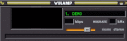
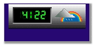

# Wu Widget

Wu Widget is a "recreation" of the original Weather Underground widget. You know, that little gif that was on everyone's website in the 90s to early 2000s? It uses the [OpenWeatherMap](https://openweathermap.org/) API to fetch the current forecast and generate a gif image from it. It also can display the gif with a scrolling forecast beneath it. The widget is also skinnable and includes lots of skins, fonts and templates for creating your own. The widget has been created to the exact specification as the original and uses the original animation timing as well as having the LED background briefly turn black when the gif loops (this is intentional. It's the aesthetic!)  

Some [examples](images/samples/):  
  
  
  
  
  
  
  

Setup is simple. Get a free API key from [OpenWeatherMap](https://openweathermap.org/) then edit the settings in wu_widget.php and display_widget.php if appplicable. The source is fully commented to guide you in setup. It should only take a few minutes to get running.  

This software is neither created nor endorsed by Weather Underground or OpenWeatherMap.
Use at your own risk.

